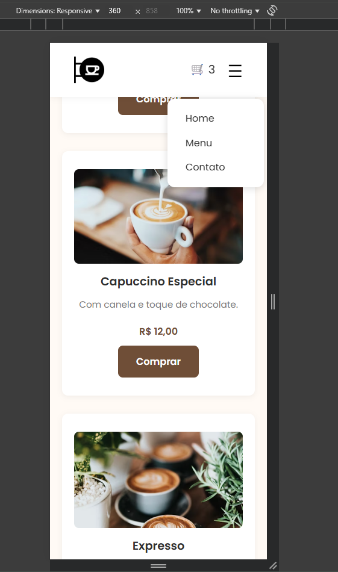

# Ctrl+Coffee - Página Web de Pedidos de Café Online

Projeto completo de uma cafeteria fictícia, desenvolvido com foco em uma experiência funcional e intuitiva. Inclui vitrine de cafés, carrinho de compras, formulário para solicitação do pedido, finalização de pedido por e-mail e um formulário para contato.

## Deploy 

Acesse o projeto online em:  
**[https://ctrl-coffee.onrender.com](https://ctrl-coffee.onrender.com)**

## imagens do projeto versão mobile

  
  

## Tecnologias Utilizadas

- HTML5 
- CSS3
- JavaScript 
- Node.js + express.js
- Nodemailer    
- Unsplash 

## Sobre imagens

- Todas as imagens utilizadas foram obtidas no Unsplash e são de uso livre.
- link: [Unsplash](https://unsplash.com/pt-br)

## Funcionalidades Implementadas:

### Página Home 

- Layout principal com vitrine de 6 cafés em destaque.
- Cada item exibe:
  - Título
  - Descrição
  - Imagem coerente com o nome
  - Preço
  - Botão Comprar

### Página Menu

- Todos os cafés da cafeteria
- Cada item exibe:
  - Título
  - Descrição
  - Imagem coerente com o nome
  - Preço
  - Botão Comprar

### Responsividade

- Abaixo de 620px:
  - Menu principal vira menu hambúrguer
  - Carrinho aparece ao lado do ícone de menu
- Media queries otimizadas para consistência

### Carrinho de compras

- Carrinho com persistência em localStorage
- Atualização automática do número de itens:
- Ações disponíveis:
  - Remover item
  - Esvaziar carrinho com modal de confirmação
  - Finalizar compra redireciona para página de finalização

### Finalização de pedido 

- Formulário com:
  - Nome
  - E-mail
  - Endereço
  - Forma de pagamento
- Pagamento em dinheiro exibe campo adicional:
  - “Precisa de troco?”
- Resumo dos itens + total
- Envio via POST para o backend
- Modais durante o processamento
- Sucesso e erro

### Página Fale Conosco - Formulário de Contato 

- Espaço para sugestões, dúvidas e pedidos especiais do cliente.
- Formulário com campos:
  - Nome
  - E-mail
  - Mensagem
- Envio assíncrono via fetch para o backend
- Modal de carregamento + sucesso/erro

## Organização e Reutilização de Estilos

- Defini as variáveis de cores globais utilizando CSS custom properties, pois idealizei desde o início que grande parte dos componentes teriam a mesma paleta de cores, então adicionei ao :root. Facilita a manutenção e dá uma aparência armonica

## Backend 
 
- Criado com express.js
- Rota POST /finalizar-pedido:
  - Recebe os dados do pedido enviados via formulário do frontend
  - Envia e-mail formatado com:
    - Nome, endereço, forma de pagamento
    - Troco (se aplicável)
    - Resumo dos cafés
  - Retorna status de sucesso ou erro para o frontend
- Rota POST /enviar-contato:
  - Recebe a mensagem e envia para o e-mail da loja
  - Nodemailer
- Variáveis sensíveis (e-mail e senha gerada para o app) via .env
- Frontend exibe modais durante o processamento e responde ao status (sucesso ou erro)

## Rotas amigáveis e redirec
- Rotas configuradas no server.js para acessar páginas sem a extensão .html no render
- Redirecionamento de /index para / para manter a URL da home limpa no Render sem /index.
- Todasas páginas são servidas via express com o método .sendFile

